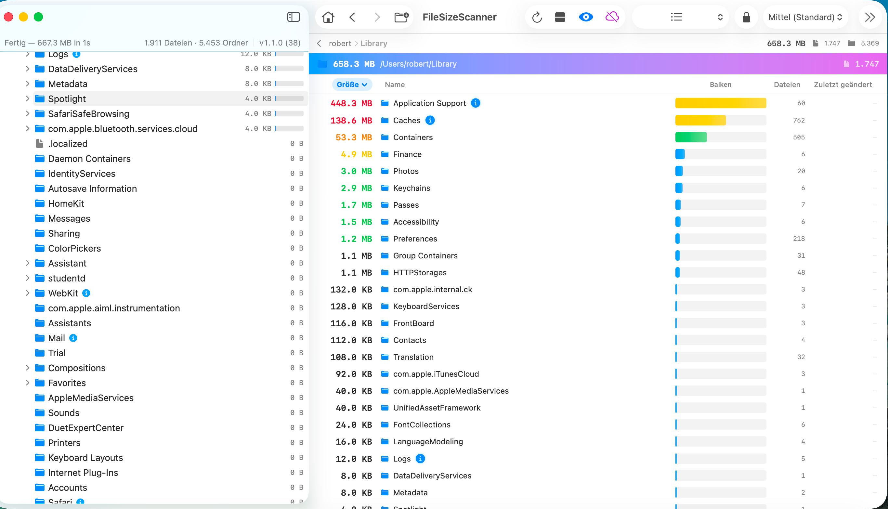
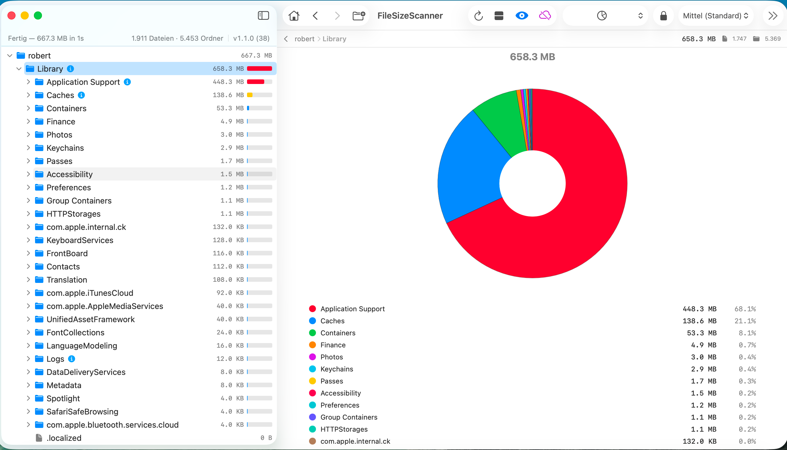
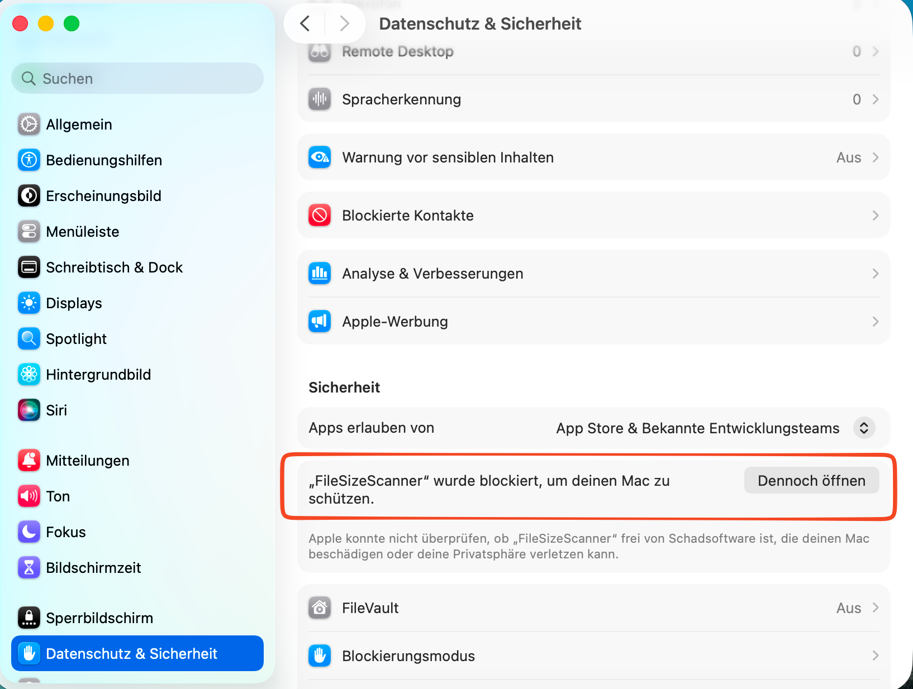

# FileSizeScanner

**A fast, native macOS app for visualizing and analyzing disk space usage.**

---

---

---

## Features

- **Multiple Visualizations** — File tree, list view, pie chart, treemap, and file type breakdown
- **Fast Scanning** — Async directory enumeration with live progress; cancellable at any time
- **Smart Bar Visualization** — Square-root scale bars make size differences immediately visible
- **Largest Files** — Top 100 largest files with one-click Reveal in Finder or Move to Trash
- **File Type Analysis** — Aggregated breakdown by extension with size and count
- **Disk Usage Overview** — Ring chart with free/used/purgeable space and APFS volume info
- **Stale File Detection** — Identifies files not modified for 1–5+ years
- **Cloud Storage Skip** — Skips OneDrive, Dropbox, iCloud Drive etc. to avoid triggering sync
- **Full Disk Access** — Permission banner guides you through granting access for system folders
- **Dark & Light Mode** — Follows macOS appearance; switchable in toolbar
- **Localized** — English and German

---

## Screenshots

### Overview — Disk usage at a glance

### List View — Sortable columns with size bars

### Pie Chart — Visual breakdown of folder contents

---

## Download

👉 **[Download FileSizeScanner.zip](./FileSizeScanner.zip)**

Unzip, move `FileSizeScanner.app` to your `/Applications` folder, and launch.

---

## First Launch — macOS Gatekeeper

macOS blocks apps from unidentified developers by default. This is expected for apps distributed outside the App Store. Follow these steps once:

1. Try to open the app — macOS shows a warning and blocks it
2. Open **System Settings** → **Privacy & Security**
3. Scroll down to the **Security** section
4. Click **"Open Anyway"** next to the FileSizeScanner entry

> This confirmation is only needed once per Mac. After that, the app opens normally.

---

## Requirements

- macOS 14.0 (Sonoma) or later
- Apple Silicon or Intel Mac

---

## Usage

1. Launch FileSizeScanner — your Home folder is scanned automatically
2. Navigate the file tree in the sidebar to drill into folders
3. Switch tabs to explore different visualizations (Overview, List View, Pie Chart, Treemap, File Types, Largest Files)
4. Click any folder to select it and see its contents in the detail panel
5. Use **Edit Mode** (lock icon in toolbar) to safely move files to Trash
6. Use the **Cloud** button in the toolbar to skip OneDrive/Dropbox during scanning

---

## Privacy

FileSizeScanner reads your filesystem to compute sizes. It does **not** collect, transmit, or store any data. All processing happens entirely on your Mac.

---

## Support

If you find a bug or have a feature request, please [open an issue](../../issues).

---

## If you like this app, buy me a beer! 🍺

