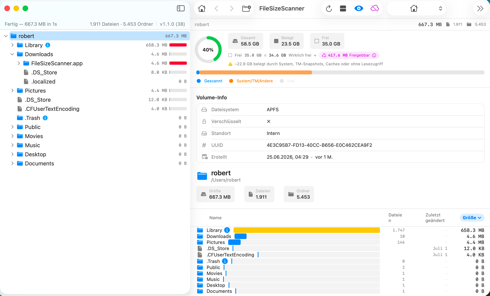

# FileSizeScanner

**A fast, native macOS app for visualizing and analyzing disk space usage.**

---

---

## Features

- **Multiple Visualizations** — File tree, list view, pie chart, treemap, and file type breakdown
- **Fast Scanning** — Async directory enumeration with live progress; cancellable at any time
- **Smart Bar Visualization** — Square-root scale bars make size differences immediately visible
- **Largest Files** — Top 100 largest files with one-click Reveal in Finder or Move to Trash
- **File Type Analysis** — Aggregated breakdown by extension with size and count
- **Disk Usage Overview** — Ring chart with free/used/purgeable space and APFS volume info
- **Stale File Detection** — Identifies files not modified for 1–5+ years
- **Cloud Storage Skip** — Skips OneDrive, Dropbox, iCloud Drive etc. to avoid triggering sync
- **Full Disk Access** — Permission banner guides you through granting access for system folders
- **Dark & Light Mode** — Follows macOS appearance; switchable in toolbar
- **Localized** — English and German

---

## Download

👉 **[Download FileSizeScanner.zip](./FileSizeScanner.zip)**

Unzip, move `FileSizeScanner.app` to your `/Applications` folder, and launch.

> **First launch:** macOS will show an "unverified developer" warning.  
> Right-click the app → **Open** → click **Open** to confirm. This is only needed once.

---

## Requirements

- macOS 14.0 (Sonoma) or later
- Apple Silicon or Intel Mac

---

## Screenshots

| Overview | List View | Treemap |
|----------|-----------|---------|
|  |  |  |

---

## Usage

1. Launch FileSizeScanner
2. Select a folder or volume from the welcome screen
3. Wait for the scan to complete
4. Navigate through the tree or switch between visualization tabs
5. Click any folder to drill down; use Back/Forward to navigate history
6. Use **Edit Mode** to safely move files to Trash

---

## Privacy

FileSizeScanner reads your filesystem to compute sizes. It does **not** collect, transmit, or store any data. All processing happens entirely on your Mac.

---

## Support

If you find a bug or have a feature request, please [open an issue](../../issues).

---

## If you like this app, buy me a beer! 🍺

